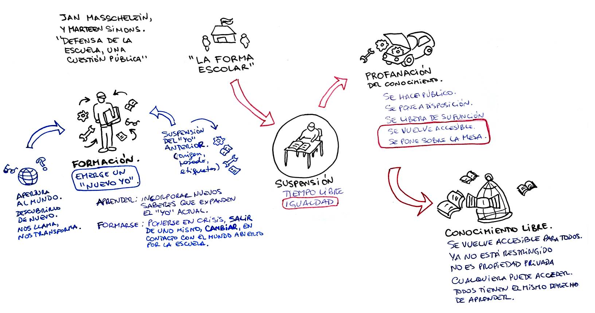

---
hide:
  - toc
---
# ¿Qué es lo escolar?

**Jan Masschelein y Marteen Simons** Resumen. Clase 2.

:headphones: [versión en audio](https://drive.google.com/file/d/1XJtAyGJ8Agb91isb6RMMP4Lep4nCXrFJ/view?usp=sharing) :blue_book: [texto original del autor](c02masschelein-o.md) :pencil: [actividades](#actividades)

El texto **"¿Qué es lo escolar?" de Jan Masschelein y Maarten Simons** es una reflexión profunda sobre la escuela como institución y como espacio de suspensión, profanación y formación. Los autores desafían la concepción tradicional de la escuela como un mero espacio de transmisión de conocimientos y habilidades para la integración en la sociedad y, en cambio, la presentan como un lugar que crea tiempo libre, interrumpe los órdenes establecidos y permite el acceso igualitario al conocimiento.

:pencil: [mapa conceptual](masschelein-mapa.jpg)

### **Estructura y puntos clave del texto**

Resumen en secciones clave:

1. **El concepto de lo escolar**
    
    - La escuela no es simplemente un medio eficiente para transmitir conocimientos y socializar a los jóvenes.
        
    - Es una invención griega que permitió separar el acceso a la educación del origen social, promoviendo la igualdad.
        
    - La escuela ofrece "tiempo libre" en el sentido de un tiempo no productivo ni funcional para la familia ni para el mercado.
        
2. **La suspensión: tiempo libre e igualdad**
    
    - La escuela separa a los estudiantes de su contexto social y económico, permitiéndoles ser simplemente estudiantes.
        
    - Los profesores también están en un espacio de suspensión: no producen resultados inmediatos como en otros trabajos.
        
    - El conocimiento en la escuela se separa de su uso social inmediato, permitiendo su estudio en sí mismo.
        
3. **La profanación: hacer lo común accesible**
    
    - La escuela convierte el conocimiento en algo público y disponible para todos.
        
    - En la escuela, el estudio y la práctica se desligan de sus aplicaciones inmediatas, lo que permite una aproximación más libre al aprendizaje.
        
    - Un mecánico en formación no arregla coches para clientes, sino que estudia motores para entenderlos.
        
4. **La atención y la apertura del mundo**
    
    - La escuela no está desconectada de la realidad, sino que es un espacio donde el mundo se revela de una manera nueva.
        
    - No se trata de motivar a los estudiantes con intereses previos, sino de exponerlos a cosas nuevas que despierten su interés.
        
    - La escuela forma a los estudiantes al hacerlos experimentar el mundo en sí mismo, más allá de su utilidad inmediata.
        

### **Reflexión**

Masschelein y Simons defienden que la escuela no debe reducirse a una herramienta de socialización o producción de capital humano. En cambio, debe mantener su capacidad de crear un tiempo y un espacio distintos, donde el aprendizaje es un fin en sí mismo y donde los estudiantes pueden descubrir el mundo de manera igualitaria.
# **Resumen detallado de "¿Qué es lo escolar?"**

:headphones: [versión en audio](https://drive.google.com/file/d/1XJtAyGJ8Agb91isb6RMMP4Lep4nCXrFJ/view?usp=sharing)
## **1. Introducción: el problema de definir lo escolar**

Los autores comienzan cuestionando la aparente obviedad de la escuela como institución educativa. Se suele asumir que la escuela es simplemente un espacio diseñado para transmitir conocimientos y habilidades necesarias para la vida en sociedad, además de ser un medio de socialización. Sin embargo, ellos advierten que esta es solo una percepción común y no necesariamente refleja la esencia de la escuela.

En oposición a esta idea, plantean que la escuela es una invención política específica de la polis griega. Su surgimiento no solo representó un modo de transmisión de conocimientos, sino también una ruptura con el orden aristocrático que definía qué grupos podían acceder a ciertos saberes. La escuela griega permitió que el conocimiento y la excelencia no estuvieran vinculados a la raza, el origen o la posición social.

La escuela, por lo tanto, se concibe como una institución que introduce un espacio-tiempo específico y diferenciado de la familia (oikos) y de la sociedad (polis). Su existencia democratiza el acceso al tiempo libre, entendiendo este no como simple ocio, sino como un tiempo igualitario y no productivo, separado de las jerarquías económicas y políticas.

### **La escuela como un espacio en disputa**

Desde sus inicios, la escuela ha sido vista con recelo por las élites, que han intentado controlarla, domesticarla o incluso eliminarla. En la actualidad, hay intentos de transformar la escuela en una extensión de la familia o en una institución orientada exclusivamente al mercado laboral. Estas reinterpretaciones desvirtúan su esencia al eliminar su función de "suspensión" y de "tiempo libre".

Los autores sostienen que la historia de la escuela es la historia de los intentos de “desescolarizarla”, es decir, de reducirla a una mera herramienta funcional para la economía o la socialización. Sin embargo, defienden la idea de que la escuela, en su sentido más puro, es un espacio donde el tiempo se libera de las exigencias sociales y económicas inmediatas.

---

## **2. La suspensión: la escuela como un espacio-tiempo liberado**

Uno de los conceptos centrales del texto es la **suspensión**, entendida como la capacidad de la escuela para interrumpir las dinámicas sociales y económicas a las que están sujetos los niños y jóvenes en su vida cotidiana.

### **Ejemplo de suspensión en la escuela**

Los autores describen un día escolar típico para ilustrar cómo la escuela crea un tiempo distinto. Desde el momento en que los niños salen de casa y entran a la escuela, se produce una desconexión de las exigencias familiares y económicas. En el aula, el aprendizaje se estructura en torno a otro tipo de lógica: hay tiempos de estudio, pausa y reflexión, sin la urgencia de la producción inmediata.

La suspensión ocurre en varios niveles:

- **Para los estudiantes:** Dejan de ser hijos, hermanos o trabajadores en formación y pasan a ser simplemente estudiantes.
    
- **Para los docentes:** Su rol no se basa en la productividad inmediata, sino en la enseñanza. No son profesionales en el sentido convencional, ya que su trabajo no se mide directamente en términos de producción.
    
- **Para el conocimiento:** Los saberes se presentan como objetos de estudio en sí mismos, no como herramientas utilitarias inmediatas.
    

### **La amenaza contra la suspensión**

El texto advierte que la educación contemporánea tiende a eliminar esta suspensión. Por ejemplo, la insistencia en etiquetar a los estudiantes según su origen social y cultural o la transformación de los docentes en "profesionales de la productividad" amenazan la capacidad de la escuela de ser un espacio liberador.

La arquitectura escolar, con aulas, patios y escritorios, también contribuye a esta separación. Los autores citan a Daniel Pennac, quien sostiene que un buen docente es capaz de llevar a los estudiantes al **presente**, desconectándolos del peso del pasado (expectativas impuestas por su origen) y del futuro (presión por lograr ciertos objetivos).

---

## **3. La profanación: liberar el conocimiento y hacerlo público**

Otro concepto clave en el texto es el de **profanación**, que significa hacer algo disponible para todos, convertirlo en un bien común y desvincularlo de su función original en la sociedad.

### **Ejemplo: la enseñanza de la mecánica en una escuela técnica**

Los autores utilizan el ejemplo de un taller de mecánica en una escuela. En este espacio, los motores y herramientas no están ahí para ser usados con fines comerciales ni para resolver problemas inmediatos de clientes. En cambio, están disponibles para el estudio y la práctica. Este distanciamiento del uso inmediato permite que el conocimiento mecánico se transforme en un objeto de estudio en sí mismo.

Lo mismo ocurre con una pizarra o un pupitre. Estos elementos no solo disciplinan, sino que también crean un espacio donde el conocimiento puede desplegarse libremente.

La escuela, entonces, convierte los saberes y destrezas en algo accesible para todos, sin estar restringidos a un grupo social particular ni a una función productiva específica.

---

## **4. La apertura del mundo: la escuela y la atención al conocimiento**

Se acusa con frecuencia a la escuela de estar desconectada de la realidad. Sin embargo, los autores sostienen que su función no es reflejar la sociedad, sino abrir el mundo a los estudiantes de una manera nueva.

En la escuela, el mundo no se presenta en términos de su aplicabilidad inmediata, sino como algo que merece ser explorado por sí mismo. Este proceso no depende de la "motivación" del estudiante, sino de la capacidad de la escuela para capturar su atención.

### **Ejemplo: la lección sobre los pájaros**

Los autores relatan la historia de una niña que siempre había visto pájaros en su entorno, pero nunca había reflexionado sobre ellos. En una clase, a través de grabados y explicaciones de su profesora, descubre que los picos de los pájaros tienen formas distintas según su alimentación. Esto cambia su percepción del mundo y la hace interesarse por la zoología.

Lo importante no es que la niña haya sido "motivada" previamente, sino que la escuela le presentó el mundo de una manera que capturó su atención.

### **Diferencia entre formación y aprendizaje**

Los autores diferencian entre **aprendizaje** y **formación**:

- **Aprender** implica adquirir conocimientos y habilidades, expandiendo el yo existente.
    
- **Formarse** significa salir de uno mismo, transformarse a través del contacto con el mundo.
    

La escuela no solo enseña información nueva, sino que cambia la forma en que los estudiantes experimentan el mundo.

---

## **Conclusión: La escuela como un espacio de inicio y transformación**

El texto concluye reafirmando que la escuela es un espacio único en el que se suspende el orden social y se abre el conocimiento al mundo de manera igualitaria. No se trata de una institución para formar trabajadores o ciudadanos funcionales, sino de un lugar donde los estudiantes pueden descubrir el mundo sin las limitaciones de su origen o destino social.

Si bien existen constantes intentos de "desescolarizar" la escuela y someterla a las exigencias del mercado o la familia, su esencia radica en la creación de un tiempo libre, no productivo, donde el conocimiento se profana y se hace accesible para todos.

---

## Actividades

## **1. ¿Por qué los autores defenderán a la “forma escolar”?**

Masschelein y Simons defienden a la "forma escolar" porque entienden que ella es **esencial para producir un tiempo y un espacio liberados** de las lógicas sociales habituales —la lógica de la familia, del mercado laboral, del origen social—.  
La forma escolar es la que crea las condiciones para que se dé algo único:

- **Suspensión** de roles sociales preexistentes (ser hijo, ser trabajador, ser paciente, etc.).
    
- **Igualdad** en el acceso a un "tiempo libre", donde todos los estudiantes, independientemente de su origen, tienen la oportunidad de enfrentarse al conocimiento y al mundo en igualdad de condiciones.
    
- **Profanación** del conocimiento y las habilidades: los saberes no son transmitidos como herramientas utilitarias inmediatas, sino como bienes públicos, disponibles para su exploración libre.
    

En síntesis:  
Defienden la "forma escolar" porque es **lo que hace posible que la educación sea una experiencia emancipadora**, en lugar de un mero entrenamiento para la vida social o económica. La forma escolar garantiza que haya un espacio-tiempo diferente, que permita comenzar algo nuevo.

**Frase que resume:**

> La forma escolar no es un simple medio técnico, sino una condición para la igualdad y para la apertura al mundo.

---

## **2. ¿Qué implica la suspensión?**

**Suspender** significa **poner entre paréntesis** lo que normalmente rige en la vida cotidiana.  
En el contexto escolar, implica:

- **Suspensión del tiempo lineal:** El tiempo no está marcado por la producción o el avance hacia objetivos inmediatos (como en el trabajo o la familia). Es un tiempo "liberado", un tiempo de estudio, de exploración.
    
- **Suspensión del origen social:** Los estudiantes no son juzgados ni definidos por su procedencia familiar, su clase social o sus antecedentes.
    
- **Suspensión de la finalidad inmediata:** El conocimiento no se enseña para aplicarlo enseguida en el mercado o en la vida práctica, sino para ser explorado en sí mismo.
    
- **Suspensión de roles:** Alumnos, docentes y materias se presentan desprovistos de su "funcionalidad" tradicional.
    

**Importante:**  
Suspender no es destruir o negar lo social o lo productivo. Es **interrumpir momentáneamente** sus exigencias para poder abrir otro tipo de experiencia, una experiencia libre de condicionamientos.

---

## **3. ¿Por qué la instancia educativa implica una suspensión del tiempo, del estatus, del/a docente y de la materia de estudio?**

Cada uno de estos elementos —el tiempo, el estatus, el docente, la materia— se transforma al ingresar en la lógica escolar. Veamos:

- **Suspensión del tiempo:**  
    En la escuela, el tiempo no sigue el ritmo de la producción o del mercado. No se trabaja bajo presión para un fin externo inmediato. Se entra en un tiempo diferente: el tiempo del estudio, de la demora, de la atención.
    
- **Suspensión del estatus:**  
    Los estudiantes dejan de ser principalmente "hijos de...", "trabajadores en formación", "enfermos", "pobres" o "ricos". Son **simplemente estudiantes**, iguales frente al saber. El docente, por su parte, no es un "experto" que transmite información como un técnico, sino alguien que acompaña en el acceso al mundo.
    
- **Suspensión del/a docente:**  
    El docente no trabaja como un profesional de la producción. No es un "operador" ni un "entrenador" para el mercado. Su rol está fuera de la lógica económica inmediata: trabaja para hacer posible el encuentro entre los jóvenes y el mundo.
    
- **Suspensión de la materia de estudio:**  
    El conocimiento (por ejemplo, las matemáticas, la mecánica, la literatura) no es enseñado con el objetivo de ser usado de inmediato en un trabajo o en la vida diaria. Se lo presenta **como materia de estudio en sí misma**, digna de ser explorada, pensada, practicada.  
    Ejemplo: aprender mecánica no es reparar un auto para un cliente; es **explorar el motor** como objeto de conocimiento.
    

**En resumen:**  
La instancia educativa implica todas estas suspensiones porque **sólo así es posible un encuentro libre y formativo con el mundo**, no mediado por utilidades, roles sociales o urgencias del mercado.

---

# **Síntesis de los conceptos en una frase**

> La escuela, en su forma escolar, crea un espacio de suspensión donde el tiempo, el estatus, el rol del docente y la materia de estudio se liberan de sus funciones habituales para hacer posible la igualdad, el estudio y el acceso a un mundo abierto.

# **Explicación del concepto de profanación en el ejemplo del taller de automotores**

En el **punto 7** del texto ("Una cuestión de profanación"), Masschelein y Simons explican que **profanar** no significa algo negativo (como en el lenguaje cotidiano), sino **liberar algo de su uso exclusivo** —sea religioso, privado o productivo— y **ponerlo a disposición pública**, para el estudio y el juego.  
En la escuela, profanar significa **tomar saberes, objetos, prácticas** que normalmente tienen un uso funcional (por ejemplo, reparar autos para clientes) y **desvincularlos de esa función inmediata**, poniéndolos **sobre la mesa** para ser estudiados y practicados libremente.

### **¿Qué quieren decir con el ejemplo del taller de automotores?**

En el taller escolar:

- Los motores no son propiedad de un cliente que espera un arreglo.
    
- No hay apuro, no hay mercado, no hay presión económica.
    
- Los motores están ahí, "como en exposición", **para ser estudiados, desarmados, reparados**, sin la exigencia de eficiencia o rentabilidad.
    
- El error, el tiempo de práctica, la exploración, **son posibles y bienvenidos**, porque no hay una función externa que cumplir.
    

**¿Qué simboliza esto?**  
Que **el objeto (el motor)** ha sido **liberado de su función comercial** y ahora está **puesto sobre la mesa** como objeto de estudio y práctica.  
Es decir, **se ha vuelto accesible** a todos los estudiantes, no importa su experiencia previa o su estatus social. Todos pueden explorarlo, tocarlo, equivocarse y aprender.

---

# **¿Qué significa que una materia o un conocimiento se vuelva accesible para el grupo?**

Cuando los autores hablan de **hacer accesible** una materia o conocimiento, se refieren a que:

- El saber ya **no está restringido** a un grupo de especialistas, a los que "nacieron para eso", o a quienes pagan por un servicio.
    
- El conocimiento **no es propiedad privada** de un gremio, una empresa o una clase social.
    
- Todos los estudiantes, **sin importar su origen**, tienen **igual derecho** a acercarse a ese conocimiento, practicarlo y hacerlo suyo.
    

**Importante:**

- Esto no quiere decir que todos ya sepan usar el conocimiento.
    
- Quiere decir que **todos tienen la oportunidad de relacionarse con él**, explorarlo, equivocarse y formarse en torno a él.
    
- Se rompe, así, la idea de que “tal cosa no es para vos” (por tu origen, tu talento supuesto, tu clase social).
    

---

# **Síntesis clara**

> El taller de automotores como ejemplo muestra que, en la escuela, el saber (el motor) se libera de su función inmediata (reparar para un cliente) y se pone sobre la mesa como objeto público de estudio, accesible a todos los estudiantes, igualando sus posibilidades de exploración, práctica y formación.

# **¿Cómo definen Masschelein y Simons a la "formación"?**

Para los autores, la **formación** no es simplemente adquirir nuevos conocimientos o habilidades (eso sería solo **aprendizaje**).  
Tampoco es adaptarse mejor a las exigencias del mercado o desarrollar competencias útiles.  
**Formarse** es algo más radical: **es transformarse como persona en relación con el mundo**.

### **¿Qué implica la formación?**

- **Suspensión del "yo" anterior:**  
    Cuando estamos realmente en la escuela, nuestro yo anterior (definido por nuestro origen, nuestras etiquetas sociales, nuestros fracasos o éxitos previos) se pone entre paréntesis.
    
- **Apertura al mundo:**  
    Nos encontramos con el mundo **de un modo nuevo**, sin que esté dictado por necesidades prácticas inmediatas. Nos exponemos a las cosas (un texto, una ecuación, un motor, una palabra) **como algo que nos llama y nos transforma**.
    
- **Emergencia de un "nuevo yo":**  
    A partir de ese encuentro, empieza a formarse un nuevo modo de ser en el mundo. Un "yo" que **no estaba definido de antemano**, que puede cambiar de dirección, abrirse, crecer.
    

### **Formación no es lo mismo que aprendizaje**

- **Aprender** = incorporar nuevos saberes o habilidades que expanden el "yo" que ya somos.
    
- **Formarse** = **ponerse en crisis**, salir de uno mismo, **cambiar** en el contacto con el mundo abierto por la escuela.
    

Los autores usan imágenes muy potentes para hablar de esto:

- Daniel Pennac habla de "pelar la cebolla" del alumno, es decir, ir liberándolo de las capas de peso social, de miedos, de fracasos, para que pueda **ser otro** en la escuela.
    
- También dicen que la formación es como el nadador que cruza un río: no es solo llegar al otro lado, sino vivir el espacio intermedio, dejarse cambiar en el cruce.
    

---

# **Síntesis en una frase**

> Para Masschelein y Simons, la formación es el proceso por el cual, gracias a la suspensión y a la apertura al mundo que la escuela produce, el estudiante puede transformarse, salir de su yo condicionado y empezar algo nuevo en su relación con el mundo.

---

# **Ejemplo sencillo para entenderlo**

- **Aprender** sería, por ejemplo, memorizar técnicas de carpintería para construir una silla.
    
- **Formarse** es descubrir en la carpintería **un mundo nuevo** (la madera, el ensamblaje, el trabajo manual), y dejar que eso **te cambie**: que despierte en vos habilidades, intereses, formas de ver y hacer que antes no existían.

